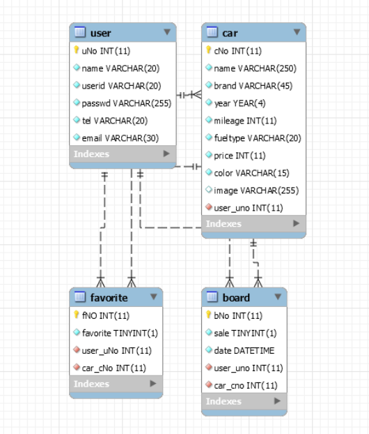

# KOSCAR
---
🚗 중고차 개인거래 사이트

## 🖥️ 프로젝트 소개
---
딜러를 거치지 않고 판매자와 구매자가 직접 거래할 수 있도록 도와주는 중고차 개인거래 플랫폼입니다. 

## 개발 기간
---
10.8 ~ 10.11 기획 / 요구사항 분석 데이터베이스 설계
워크 플로우 및 화면 설계
10.14 ~ 10.18 개발

## 팀원 소개 및 역할 분담
---

## 사용 기술
---
<table style="width: 100%; border-collapse: collapse;">
  <tr>
    <td style="width: 25%; vertical-align: top; padding: 10px; border: 1px solid #ddd;">
      <h3 style="margin: 0; font-weight: bold;">1. Database</h3>
      <ul style="list-style-type: none; padding: 0;">
        <li style="margin-left:18%">MySQL</li>
      </ul>
    </td>
    <td style="width: 25%; vertical-align: top; padding: 10px; border: 1px solid #ddd;">
      <h3 style="margin: 0; font-weight: bold;">2. Backend</h3>
      <ul style="list-style-type: none; padding: 0;">
        <li  style="margin-left:18%">Node.js</li>
        <li  style="margin-left:18%">Express.js</li>
      </ul>
    </td>
    <td style="width: 25%; vertical-align: top; padding: 10px; border: 1px solid #ddd;">
      <h3 style="margin: 0; font-weight: bold;">3. Frontend</h3>
      <ul style="list-style-type: none; padding: 0;">
        <li>HTML5, CSS3, JavaScript</li>
        <li>React</li>
        <li>Styled-components</li>
        <li>Bootstrap</li>
      </ul>
    </td>
    <td style="width: 25%; vertical-align: top; padding: 10px; border: 1px solid #ddd;">
      <h3 style="margin: 0; font-weight: bold;">4. Tools</h3>
      <ul style="list-style-type: none; padding: 0;">
        <li>VS Code</li>
        <li>MySQL Workbench</li>
        <li>GitHub</li>
      </ul>
    </td>
  </tr>
</table>

## 데이터베이스 ERD(Entity-Relationship Diagram)
---

<table style="width: 100%; border-collapse: collapse; text-align: center;">
  <tr>
    <td style="width: 25%; vertical-align: top; padding: 15px; border: 1px solid #ddd;">
      <h3 style="margin: 10px 0; font-weight: bold;">1. user (사용자 정보)</h3>
      <ul style="list-style-type: none; padding: 0;">
        <li style="margin: 5px 0;">uNo (PK)</li>
        <li style="margin: 5px 0;">name</li>
        <li style="margin: 5px 0;">userid (Unique)</li>
        <li style="margin: 5px 0;">passwd</li>
        <li style="margin: 5px 0;">tel</li>
        <li style="margin: 5px 0;">email</li>
      </ul>
    </td>
    <td style="width: 25%; vertical-align: top; padding: 15px; border: 1px solid #ddd;">
      <h3 style="margin: 10px 0; font-weight: bold;">2. car (차량 정보)</h3>
      <ul style="list-style-type: none; padding: 0;">
        <li style="margin: 5px 0;">cNo (PK)</li>
        <li style="margin: 5px 0;">name</li>
        <li style="margin: 5px 0;">brand</li>
        <li style="margin: 5px 0;">year</li>
        <li style="margin: 5px 0;">mileage</li>
        <li style="margin: 5px 0;">fuelType</li>
        <li style="margin: 5px 0;">price</li>
        <li style="margin: 5px 0;">color</li>
        <li style="margin: 5px 0;">image</li>
        <li style="margin: 5px 0;">user_uNo (FK)</li>
      </ul>
    </td>
    <td style="width: 25%; vertical-align: top; padding: 15px; border: 1px solid #ddd;">
      <h3 style="margin: 10px 0; font-weight: bold;">3. board (게시글 정보)</h3>
      <ul style="list-style-type: none; padding: 0;">
        <li style="margin: 5px 0;">bNo (PK)</li>
        <li style="margin: 5px 0;">sale</li>
        <li style="margin: 5px 0;">date</li>
        <li style="margin: 5px 0;">user_uNo (FK)</li>
        <li style="margin: 5px 0;">car_cNo (FK)</li>
      </ul>
    </td>
    <td style="width: 25%; vertical-align: top; padding: 15px; border: 1px solid #ddd;">
      <h3 style="margin: 10px 0; font-weight: bold;">4. favorite (찜하기 정보)</h3>
      <ul style="list-style-type: none; padding: 0;">
        <li style="margin: 5px 0;">fNo (PK)</li>
        <li style="margin: 5px 0;">favorite</li>
        <li style="margin: 5px 0;">user_uNo (FK)</li>
        <li style="margin: 5px 0;">car_cNo (FK)</li>
      </ul>
    </td>
  </tr>
</table>

